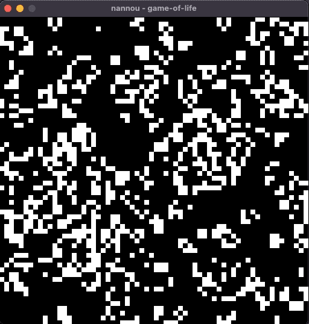

# Game of life

Just the good old [Game of Life](https://en.wikipedia.org/wiki/Conway%27s_Game_of_Life), implemented in Rust, as an exercise done to learn Rust and [nannou](https://nannou.cc/).

## Run
You'll need to have rust installed, yatta yatta..

```bash
$ cargo run --release
```

## Example run



## Notes

Being a learning exercise, this implementation is not particularly efficient.

The grid fully lives on the stack, since is modelled as arrays (not vectors), so the max size is quite limited. Plus, there's probably a few copies going around that might be avoided.

As a future exercise, I might try to rewrite this using the `ndarray` crate, but for now I wanted to implement GoL without any external dependency.